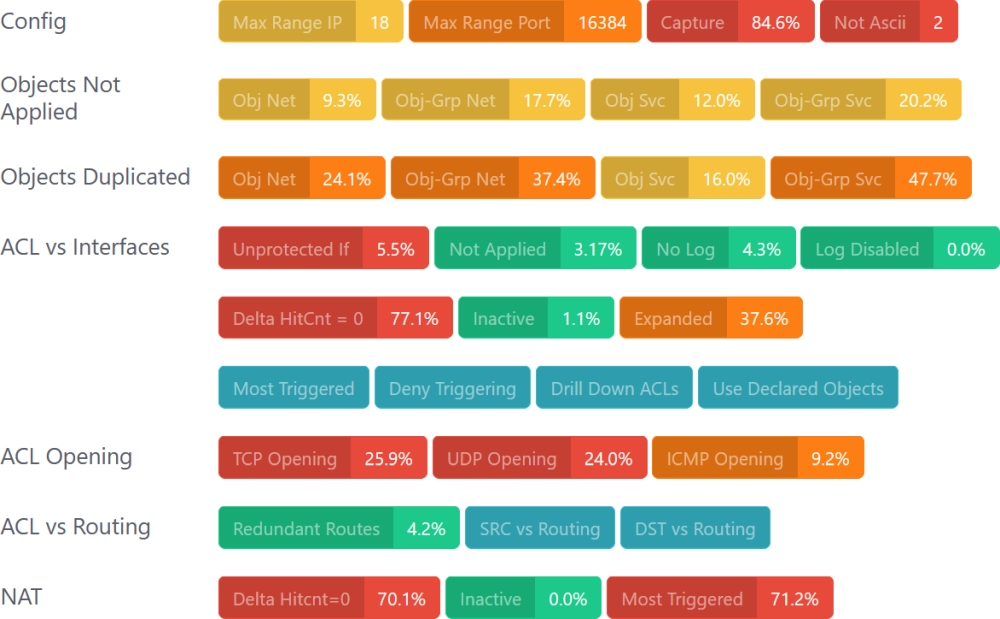
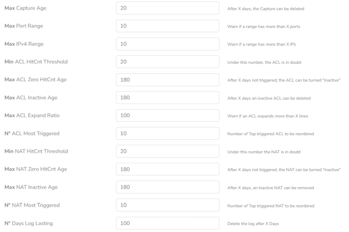

# WTF.v1
WatchThisFirewall is a firewall assessment tool designed to connect to firewalls and perform a comprehensive analysis of their configurations. It checks for misconfigurations, ensures compliance, and optimizes rules. At the moment only Cisco ASA is supported.

<div align="center">
  
</div>
<br>

[![git commits][41]][42] [![Version][2]][3] [![Downloads][6]][7] [![License][8]][9] [![Hatch project][68]][69]


# What is WatchThisFirewall
WatchThisFirewall is a firewall assessment tool, it is a specialized software solution that thoroughly analyzes firewall configurations, policies, and performance to enhance security and ensure compliance with industry standards. It identifies unused, redundant, or misconfigured objects, NAT rules and access control lists (ACLs), highlighting potential vulnerabilities and inefficiencies.  
By optimizing firewall settings, the tool ensures better traffic flow, resource utilization, and overall security posture. Additionally, it generates detailed reports with actionable recommendations, simplifying remediation and ongoing firewall management helping administrators maintain a secure, well-structured network with ease.  
  
The tool is based on Python 3.11 and the package is composed by three containers:
- The Database (postgres:14-alpine)
- The Django Engine (python:3.11-slim)
- The Job Scheduler (python:3.11-slim)


# How Does it Work
It connects to a device and retrive the output from the following commands
```
term page 0
show ver
show run access-group
show nameif
show interface
show capture
show running-config
show route
show access-list
show nat detail
show crypto ipsec sa entry (Under Development)
show clock (When Testing The Connection)
```

It elaborate the output and produce several reports. Below the summary report for each device.
<div align="center">
  
</div>
<br>
Simply by tracking the configuration length over time, it becomes easy to see whether the device is maintained and kept clean.
<br>
<div align="center">
  
</div>
Settings can be easily costomized according to the specific network guide lines.
<div align="center">
  
</div>

## Recommendations
> [!CAUTION]
We strongly recommend configuring your TACACS or RADIUS server to grant this tool only the minimum required privileges, ensuring it uses unique credentials for login.

# How Do I get Started?
## 1. Prerequisites
Before starting, ensure the [Docker Desktop](https://www.docker.com/) package that suits your environment is installed on your system.
## 2. Pull the Docker Image
Use the pull command ```docker pull <image_name>:<tag>``` to download the Docker image.

# Dependencies
```
asgiref==3.8.1
bcrypt==4.2.0
cffi==1.17.0
cryptography==43.0.0
Django==4.2.15
django-background-tasks==1.2.8
et-xmlfile==1.1.0
future==1.0.0
greenlet==3.0.3
netmiko==4.4.0
ntc_templates==6.0.0
numpy==1.23.5
openpyxl==3.1.5
pandas==1.5.3
paramiko==3.4.1
psycopg2==2.9.9
pycparser==2.22
PyNaCl==1.5.0
pyserial==3.5
python-dateutil==2.9.0.post0
pytz==2024.1
PyYAML==6.0.2
scp==0.15.0
six==1.16.0
SQLAlchemy==2.0.32
psycopg2-binary==2.9.5
sqlparse==0.5.1
tabulate==0.9.0
textfsm==1.1.3
typing_extensions==4.12.2
tzdata==2024.1  
```
# Supported Network Device
- Cisco ASA
# License
Code released under the [GNU GPLv3](https://github.com/WatchThisFirewall/WTF.v1/blob/main/LICENSE) License
# Author
[ciscoconfparse2][3] was written by [David Michael Pennington][25].
```"watch-this-firewall_at_gmail.com"    .replace('_at_','@').replace('-','')```


  [1]: https://github.com/mpenning/ciscoconfparse2/blob/main/.github/workflows/tests.yml
  [2]: https://img.shields.io/pypi/v/ciscoconfparse2.svg
  [3]: https://pypi.python.org/pypi/ciscoconfparse2/
  [4]: https://github.com/mpenning/ciscoconfparse2/actions/workflows/tests.yml/badge.svg
  [5]: https://github.com/mpenning/ciscoconfparse2/actions/workflows/tests.yml
  [6]: https://pepy.tech/badge/ciscoconfparse2
  [7]: https://pepy.tech/project/ciscoconfparse2
  [8]: http://img.shields.io/badge/license-GPLv3-blue.svg
  [9]: https://www.gnu.org/copyleft/gpl.html
  [10]: https://www.python.org
  [11]: https://raw.githubusercontent.com/mpenning/ciscoconfparse/master/sphinx-doc/_static/ciscoconfparse_overview_75pct.png
  [12]: https://github.com/mpenning/ciscoconfparse2/blob/main/pyproject.toml
  [13]: https://github.com/mpenning/ciscoconfparse2/blob/master/configs/sample_01.junos
  [14]: https://github.com/mpenning/ciscoconfparse/issues/17
  [15]: http://www.pennington.net/py/ciscoconfparse2/
  [16]: http://pennington.net/tutorial/ciscoconfparse2/ccp_tutorial.html
  [17]: https://github.com/mpenning/ciscoconfparse2
  [18]: https://github.com/mpenning/ciscoconfparse/issues/117
  [19]: https://github.com/mpenning/ciscoconfparse/issues/13
  [20]: https://github.com/CrackerJackMack/
  [21]: http://www.gnu.org/licenses/gpl-3.0.html
  [22]: https://pypy.org
  [23]: https://networkengineering.stackexchange.com/
  [24]: https://github.com/mpenning/ciscoconfparse2/issues/new/choose
  [25]: https://github.com/mpenning
  [26]: https://github.com/muir
  [27]: https://www.cisco.com/
  [28]: https://www.cisco.com/go/support
  [29]: https://www.cymru.com/Documents/secure-ios-template.html
  [30]: https://team-cymru.com/company/
  [31]: http://www.cisco.com/c/en/us/support/docs/ip/access-lists/13608-21.html
  [32]: https://learn.cisecurity.org/benchmarks
  [33]: https://stackoverflow.com
  [34]: http://stackoverflow.com/questions/ask
  [35]: https://www.reddit.com/r/Cisco/
  [36]: https://www.reddit.com/r/networking
  [37]: https://snyk.io/advisor/python/ciscoconfparse2/badge.svg
  [38]: https://snyk.io/advisor/python/ciscoconfparse2
  [39]: https://www.reddit.com/r/Python/
  [41]: https://img.shields.io/github/commit-activity/m/mpenning/ciscoconfparse2
  [42]: https://img.shields.io/github/commit-activity/m/mpenning/ciscoconfparse2
  [43]: https://www.codefactor.io/Content/badges/B.svg
  [44]: https://www.codefactor.io/repository/github/mpenning/ciscoconfparse2/
  [45]: https://fossa.com/blog/open-source-software-licenses-101-gpl-v3/
  [46]: https://app.codacy.com/project/badge/Grade/4774ebb0292d4e1d9dc30bf263d9df14
  [47]: https://app.codacy.com/gh/mpenning/ciscoconfparse2/dashboard
  [48]: https://commitizen-tools.github.io/commitizen/
  [49]: https://semver.org/
  [50]: https://www.conventionalcommits.org/en/v1.0.0/
  [51]: https://sonarcloud.io/api/project_badges/measure?project=mpenning_ciscoconfparse2&metric=alert_status
  [52]: https://sonarcloud.io/summary/new_code?id=mpenning_ciscoconfparse2
  [53]: https://sonarcloud.io/api/project_badges/measure?project=mpenning_ciscoconfparse2&metric=sqale_rating
  [54]: https://sonarcloud.io/summary/new_code?id=mpenning_ciscoconfparse2
  [55]: https://sonarcloud.io/api/project_badges/measure?project=mpenning_ciscoconfparse2&metric=ncloc
  [56]: https://sonarcloud.io/summary/new_code?id=mpenning_ciscoconfparse2
  [57]: https://sonarcloud.io/api/project_badges/measure?project=mpenning_ciscoconfparse2&metric=code_smells
  [58]: https://sonarcloud.io/summary/new_code?id=mpenning_ciscoconfparse2
  [59]: https://sonarcloud.io/api/project_badges/measure?project=mpenning_ciscoconfparse2&metric=bugs
  [60]: https://sonarcloud.io/summary/new_code?id=mpenning_ciscoconfparse2
  [61]: https://sonarcloud.io/api/project_badges/measure?project=mpenning_ciscoconfparse2&metric=sqale_index
  [62]: https://sonarcloud.io/summary/new_code?id=mpenning_ciscoconfparse2
  [63]: https://docs.pytest.org/en/
  [64]: https://github.com/mpenning/ciscoconfparse
  [65]: https://pypi.org/project/ciscoconfparse/1.9.41/
  [66]: https://raw.githubusercontent.com/mpenning/ciscoconfparse2/main/sphinx-doc/_static/ciscoconfparse_logo_bw_01.png
  [67]: http://www.pennington.net/py/ciscoconfparse2/cli.html
  [68]: https://img.shields.io/badge/%F0%9F%A5%9A-Hatch-4051b5.svg
  [69]: https://github.com/pypa/hatch
  [70]: http://www.pennington.net/py/ciscoconfparse2/examples.html
