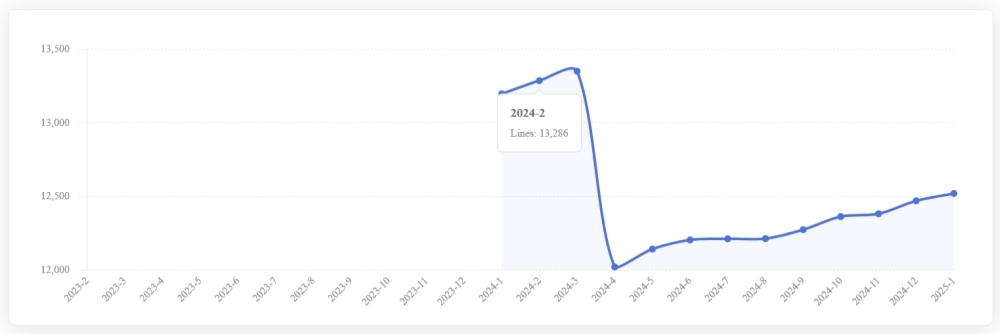
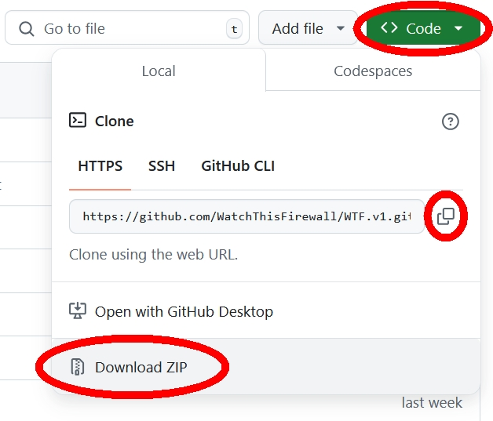

# WTF.v1
WatchThisFirewall is a firewall assessment tool designed to connect to firewalls and perform a comprehensive analysis of their configurations. It checks for misconfigurations, ensures compliance, and optimizes rules. At the moment only Cisco ASA is supported.

<div align="center">
  
</div>

# What is WatchThisFirewall
WatchThisFirewall is a firewall assessment tool, it is a specialized software solution that thoroughly analyzes firewall configurations, policies, and performance to enhance security and ensure compliance with industry standards. It identifies unused, redundant, or misconfigured objects, NAT rules and access control lists (ACLs), highlighting potential vulnerabilities and inefficiencies.  
By optimizing firewall settings, the tool ensures better traffic flow, resource utilization, and overall security posture. Additionally, it generates detailed reports with actionable recommendations, simplifying remediation and ongoing firewall management helping administrators maintain a secure, well-structured network with ease.  
  
The tool is based on Python 3.11 and the package is composed by three containers:
- The Database (postgres:14-alpine)
- The Django Engine (python:3.11-slim)
- The Job Scheduler (python:3.11-slim)

# Table of Contents
- [How Does it Work?](#How-Does-it-Work)
- [How Do I get Started?](#How-Do-I-get-Started)
- [What Next?](#What-Next)
- [Supported Network Devices](#Supported-Network-Devices)


# How Does it Work?
It connects to a device and retrive the output from the following commands
```
term page 0
show ver
show run access-group
show nameif
show interface
show capture
show running-config
show route
show access-list
show nat detail
show crypto ipsec sa entry (Under Development)
show clock (When Testing The Connection)
```

It elaborate the output and produce several reports. Below the summary report for each device.
<div align="center">
  
</div>
<br>
Simply by tracking the configuration length over time, it becomes easy to see whether the device is maintained and kept clean.
<br>
<div align="center">
  
</div>
Settings can be easily costomized according to your specific network requirements or guide lines.

```
- Max Capture Age             20      After X days, the Capture can be deleted
- Max Port Range              10      Warn if a range has more than X ports
- Max IPv4 Range              10      Warn if a range has more than X IPs
- Min ACL HitCnt Threshold    20      Under this number, the ACL is in doubt
- Max ACL Zero HitCnt Age     180     After X days not triggered, the ACL can be turned "inactive"
- Max ACL Inactive Age        180     After X days an inactive ACL can be deleted
- Max ACL Expand Ratio        100     Warn if an ACL expands more than X lines
- N° ACL Most Triggered       10      Number of Top triggered ACL to be reordered
- Min NAT HitCnt Threshold    20      Under this number the NAT is in doubt
- Max NAT Zero HitCnt Age     180     After X days not triggered, the NAT can be turned "inactive"
- Max NAT Inactive Age        180     After X days, an inactive NAT can be deleted
- N° NAT Most Triggered       10      Number of Top triggered NAT to be reordered
- N° Days Log Lasting         100     Delete the log after X Days
```

## Recommendations
> [!CAUTION]
We strongly recommend configuring your TACACS or RADIUS server to grant this tool only the minimum required privileges, ensuring it uses unique credentials for login.

# How Do I get Started?
## 1. Prerequisites
Before starting, ensure the [Docker Desktop](https://www.docker.com/) package that suits your environment is installed on your system.
## 2. Get the Source Files
Download or Clone the project
<div align="center">
  
</div>

## 3. Edit the ".env" (environment) file and be sure to change the following parameters

```
DJANGO_SECRET_KEY=o0@!62+2spd)dq!5tkw@yaxp4y7zb&%)^1)-dosx0i_c9-o_+z
POSTGRES_USER=postgres
POSTGRES_PASSWORD=postgres
DJANGO_SUPERUSER_USERNAME=django_admin
DJANGO_SUPERUSER_PASSWORD=django_admin_pwd
```
## 4. Pull and Run the Containers
Run this command from the folder where the .env file is located

```
docker-compose -f docker-compose.yml -f docker-compose.prod.yml up
```
# What Next?
## 1. Connect to the Server
Open a Browser and go to the server's IP on http port 8001

```
http://<SERVER_IP_ADDRESS>:8001 (or http://localhost:8001 if local)
```
## 2. Login to the Server
Login using the credentials you changed before:

```
DJANGO_SUPERUSER_USERNAME=django_admin
DJANGO_SUPERUSER_PASSWORD=django_admin_pwd
```
## 3. The Admin User
Go to "Settings" => "User Settings"   
Edit the User and put him in the "Admin" Group  
Only Admin users can Add/Remove Devices or change the Global Settings

## 4. Add a Device
Go to "Settings" => "Device Settings" => "Add Device"  
Fill in the Form  
Test the Connection  
Once it is OK you can run the Check manually or wait for the scheduler to do the job for you

# Dependencies
```
asgiref==3.8.1
bcrypt==4.2.0
cffi==1.17.0
cryptography==43.0.0
Django==4.2.15
django-background-tasks==1.2.8
et-xmlfile==1.1.0
future==1.0.0
greenlet==3.0.3
netmiko==4.4.0
ntc_templates==6.0.0
numpy==1.23.5
openpyxl==3.1.5
pandas==1.5.3
paramiko==3.4.1
psycopg2==2.9.9
pycparser==2.22
PyNaCl==1.5.0
pyserial==3.5
python-dateutil==2.9.0.post0
pytz==2024.1
PyYAML==6.0.2
scp==0.15.0
six==1.16.0
SQLAlchemy==2.0.32
psycopg2-binary==2.9.5
sqlparse==0.5.1
tabulate==0.9.0
textfsm==1.1.3
typing_extensions==4.12.2
tzdata==2024.1  
```
# Supported Network Devices
- Cisco ASA
# License
Code released under the [GNU GPLv3](https://github.com/WatchThisFirewall/WTF.v1/blob/main/LICENSE) License
# Authors

```"watch-this-firewall_at_gmail.com".replace('_at_','@').replace('-','')```

# Demo
A static demo can be found at [http://wtf.infinityfreeapp.com/index.html](http://wtf.infinityfreeapp.com/index.html)


